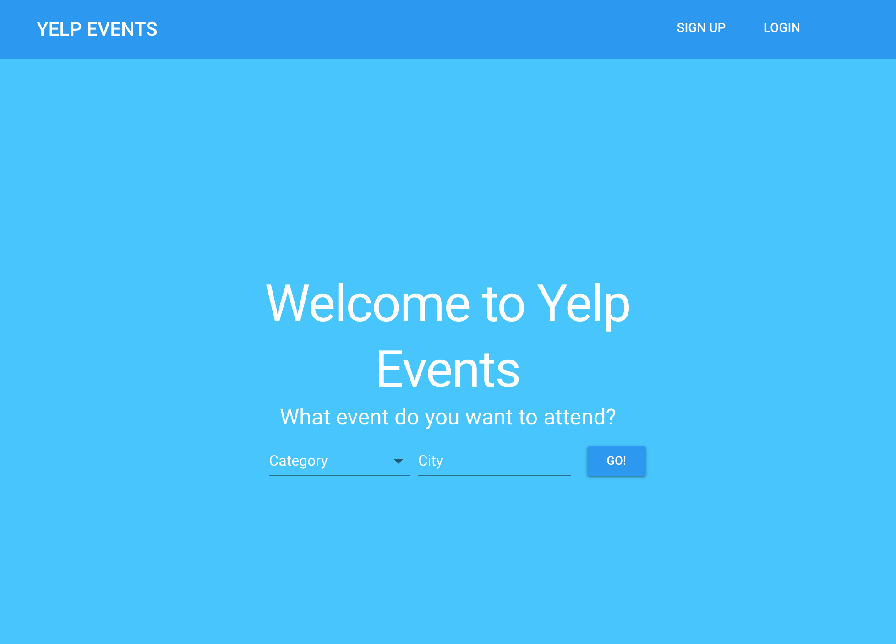

# YelpEvents

This is a website where users can search for Yelp events and persist events they are interested in.
Users can search for events by category and city.



YelpEvents is built upon:

- [Material UI](https://material-ui.com)
- [Flow](https://flow.org/en)
- [React](https://facebook.github.io/react)
- [React Router](https://github.com/ReactTraining/react-router)
- [Redux](https://github.com/reactjs/redux)
- [Redux Sagas](https://github.com/redux-saga/redux-saga)
- [Redux Form](https://redux-form.com/7.3.0)
- [Node.js](https://nodejs.org)
- [Express](http://expressjs.com)
- [Passport](http://passportjs.org)
- [MongoDB](https://www.mongodb.com)

## Installation Instructions

- Install [Node.js](https://nodejs.org/) and npm.
- Install [MongoDB](https://www.mongodb.com/).
- Retrieve the repository and install dependencies.

```bash
$ git clone https://github.com/puntnomads/YelpEvents.git
$ cd YelpEvents
$ cd server
$ npm install
$ cd YelpEvents
$ cd client
$ npm install
```

## Running the app locally

Start the API

```bash
$ cd server
$ npm start
```

Start React in another Terminal window

```bash
$ cd client
$ npm start
```

Then visit `http://localhost:3000/`
